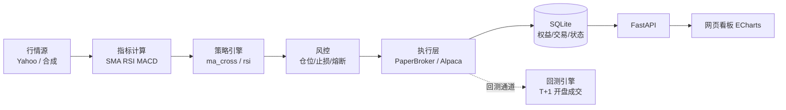

# 量化智能体（Quant Agent）

一个开箱即用的个人量化交易系统：**行情 → 策略信号 → 风控 → 自动执行 → 网页看板**。
默认运行在**模拟盘（Paper Trading）**模式，不涉及真实资金；预留券商适配器，可扩展接入真实账户。

> ⚠️ 本项目仅供学习与研究。自动交易存在真实亏损风险，实盘前务必先在模拟盘充分验证；本项目不构成任何投资建议。

## 特性

- 📈 **行情层**：Yahoo Finance 真实美股行情；离线合成行情（无网可演示全流程）
- 🧠 **策略层**：内置双均线金叉/死叉、RSI 超买超卖；`Strategy` 基类可扩展任意策略
- 🛡 **风控层**：按权益比例控仓位、止损线、最大回撤熔断（禁止开新仓）
- 🤖 **执行层**：模拟盘撮合（本地组合记账）；Alpaca 券商适配器（可选，接真实/模拟盘 API）
- 🔬 **回测引擎**：事件驱动，T 日收盘出信号 → T+1 开盘成交；输出总收益、年化、夏普、最大回撤、胜率等指标，并与买入持有基准对比
- 📊 **网页看板**：ECharts 可视化权益曲线、K 线与买卖信号、持仓、交易记录；一键启停自动交易

## 快速开始

```bash
# 1. 安装依赖
pip install -r requirements.txt

# 2. 运行历史回测（离线演示数据，无需网络）
python run.py backtest --symbol AAPL --strategy ma_cross --days 500 --offline

# 3. 启动网页看板（默认 http://127.0.0.1:8000）
python run.py serve --config config.demo.yaml   # 离线演示
# 或 python run.py serve                        # 真实 Yahoo 行情

# 4. 启动自动交易（模拟盘）
python run.py agent --offline                   # 离线演示，10s 轮询
# 或 python run.py agent                        # 真实行情
```

浏览器打开看板后：选择标的/策略/天数 → 点击「运行回测」查看绩效；点击「启动自动交易」让 Agent 按信号自动买卖（模拟盘）。

## 项目结构

```
quant-agent/
├── run.py                  # CLI 入口（backtest / serve / agent）
├── config.yaml             # 主配置
├── config.demo.yaml        # 离线演示配置
├── quant/
│   ├── config.py           # 配置 + .env 加载
│   ├── indicators.py       # SMA/EMA/RSI/MACD
│   ├── portfolio.py        # 模拟组合：现金/持仓/成交/PnL
│   ├── risk.py             # 仓位、止损、熔断
│   ├── backtest.py         # 事件驱动回测引擎 + 绩效指标
│   ├── agent.py            # 自动交易 Agent（轮询调度）
│   ├── storage.py          # SQLite 持久化（权益/交易/状态）
│   ├── data/feed.py        # YahooFeed / SyntheticFeed
│   ├── strategy/           # 策略基类 + 内置策略
│   ├── execution/          # PaperBroker / AlpacaBroker
│   └── api/server.py       # FastAPI：看板数据 + 回测 + 启停
├── web/index.html          # 网页看板（ECharts，本地优先+CDN兜底）
└── tests/                  # pytest 单元测试
```

## 架构



## API 一览

| 方法 | 路径 | 说明 |
|---|---|---|
| GET | `/` | 网页看板 |
| GET | `/api/state` | Agent 状态（运行、现金、权益、持仓、最近信号） |
| GET | `/api/equity?limit=1000` | 权益曲线 |
| GET | `/api/trades?limit=200` | 交易记录 |
| GET | `/api/strategies` | 可用策略与标的 |
| GET | `/api/backtest?symbol=AAPL&strategy=ma_cross&days=500` | 运行回测，返回指标/曲线/交易 |
| POST | `/api/agent/start` / `/api/agent/stop` | 启停自动交易 |

## 配置与实盘接入

- 所有参数集中在 `config.yaml`：数据源、策略、仓位、止损、熔断、轮询间隔、标的多等。
- 接真实券商：在 `.env` 填 `ALPACA_API_KEY` / `ALPACA_SECRET_KEY`（示例见 `.env.example`），把 `broker.paper` 设为 `false`。
  默认 `base_url` 为 Alpaca **paper-api**（模拟盘），请先在模拟环境验证，再评估切换真实账户。
- 新增市场（币圈/A股等）：实现 `BrokerAdapter` 接口（`market_order` / `get_prices`）并在 `agent._make_broker` 中注册即可，核心引擎无需改动。

## 已知限制

- 日线级别轮询，成交价以最新收盘价近似市价（演示场景可接受）。
- 单标的持仓，策略信号与止损共用一套轮询逻辑；多标的并行、分钟级数据、滑点模型等列入路线图。
- Yahoo 行情需可访问外网；离线演示请使用 `config.demo.yaml`。

## 路线图

- [ ] 多标的并行轮询与组合级风控
- [ ] 分钟级数据与盘中执行（滑点、部分成交）
- [ ] 更多内置策略（MACD、布林带、动量）与参数寻优
- [ ] 币圈交易所适配器（Binance/OKX 等）
- [ ] 消息推送（飞书/Telegram）与定时任务调度

## 测试

```bash
python -m pytest tests -q
```
